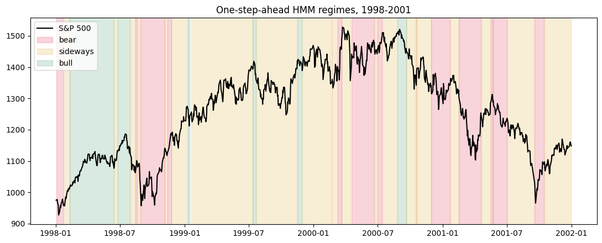
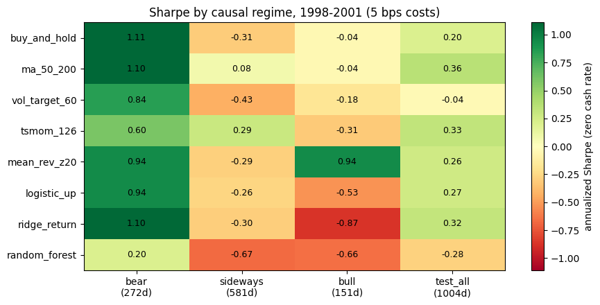
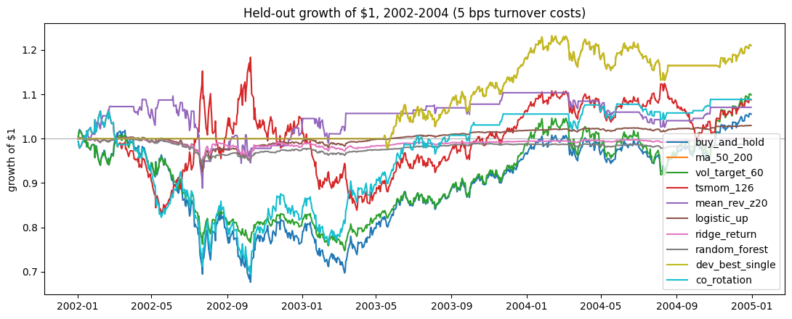
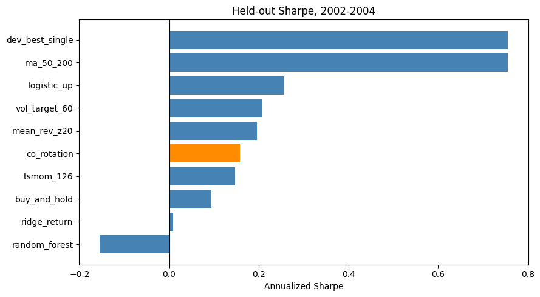
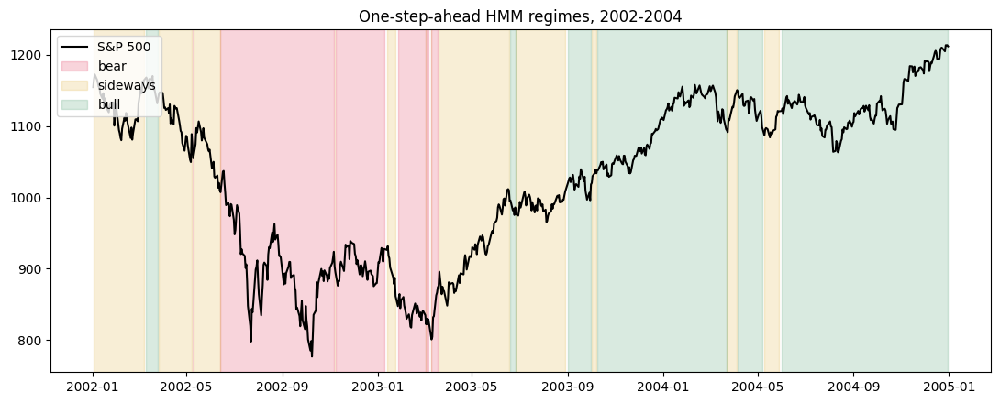

Implemented varieties of trading algorithms. Benchmark different algorithms performance in different regimes and whole training datasets. notebooks/sp500/sp500_regime_algorithm_matrix.ipynb This helps us to develop a combined algorithm to greedyly all-in in the best Sharpe Ratio Strategy given refit the past data on the ML and classical algorithms. In the future, we will also include the risk assessment to reduce the MDD.

- This week we ran the regime-by-algorithm experiments. We implemented classical signal-based strategies (moving-average crossover, volatility targeting, time-series momentum, mean reversion) and classic machine-learning ones (logistic regression, ridge regression, random forest), then benchmarked them after the HMM split the S&P 500 into three regimes (notebooks/sp500/sp500_regime_algorithm_matrix.ipynb).
- Regimes are labeled from fitted mean and volatility: highest-volatility state is bear, highest-mean state is bull, the remaining near-zero-mean state is sideways. The goal was to check whether causal regime signals help the algorithms.
- Development selection on 1998-2001 (net Sharpe per regime): bear -> buy_and_hold (1.11), sideways -> tsmom_126 (0.29), bull -> mean_rev_z20 (0.94).
- Best contender so far is ma_50_200 (long when MA50 > MA200, flat otherwise); buy-and-hold is close behind.
- Second experiment: co-rotation, all-in on the best development strategy per regime and switching when the regime switches (notebooks/sp500/sp500_sharpe_benchmark.ipynb). Train 1988-1997, development 1998-2001, test 2002-2004; the test set was not used when selecting the best strategy per regime.
- Test 2002-2004, Sharpe / max drawdown: ma_50_200 0.755 / -8.2%; co_rotation 0.158 / -34.8%; buy_and_hold 0.094 / -33.8%; random_forest -0.155 / -5.9%. Co-rotation stays positive, above buy-and-hold, but not as good as ma_50_200.
- The benchmark plots both windows with causal one-step-ahead labels: the 2002-2004 test window shows the 2002 decline as bear, the chop as sideways, and the 2003-2004 rally as bull (181/250/325 days).
- All 8 leakage tests pass (tests/test_sp500_regime_algorithm_matrix.py): feature lagging, future-price perturbation, boundary carry-over, cost grouping.
- Future work: size positions by risk instead of all-in/all-out, and build a combined algorithm that uses regime signals to beat ma_50_200 in the test period.

Final test performance (sharpe, max_drawdown, ann_return, ann_volatility, exposure):

    ma_50_200         0.755        -0.082       0.064           0.084     0.471
    dev_best_single   0.755        -0.082       0.064           0.084     0.471
    logistic_up       0.255        -0.077       0.010           0.038     0.108
    vol_target_60     0.208        -0.266       0.031           0.151     0.975
    mean_rev_z20      0.196        -0.190       0.023           0.116     0.255
    co_rotation       0.158        -0.348       0.028           0.179     0.635
    tsmom_126         0.147        -0.291       0.028           0.191     1.000
    buy_and_hold      0.094        -0.338       0.018           0.191     1.000
    ridge_return      0.009        -0.058       0.000           0.033     0.093
    random_forest    -0.155        -0.059      -0.004           0.025     0.095

   

## Strategy reference

All signals use closes through yesterday and set today's position, so no strategy sees the day it trades (src/model_evaluation/market_strategy/strategies.py and notebooks/sp500/sp500_regime_algorithm_matrix.py).

- buy_and_hold: always 100% invested; the benchmark every strategy must beat.
- ma_50_200: long when the 50-day SMA is above the 200-day SMA, cash otherwise; a trend-follower that exits after sustained declines.
- vol_target_60: no directional view; weight = 15% target volatility divided by the 60-day trailing annualized volatility, capped at 1.5; sizes down in volatile markets and up in calm ones.
- tsmom_126: long/short the sign of the trailing 126-day return (about six months); rides whatever trend is in place.
- mean_rev_z20: long after yesterday's close drops more than 1 standard deviation below its 20-day average, cash otherwise; bets on dips bouncing back.
- ML leg (logistic_up, ridge_return, random_forest): features are yesterday's return, 60-day volatility, and 20-day mean return, fitted on 1988-1997 only; logistic and forest trade 2 \* P(up) - 1, ridge trades its predicted return scaled by the training standard deviation, both clipped to [-1, 1.5].
